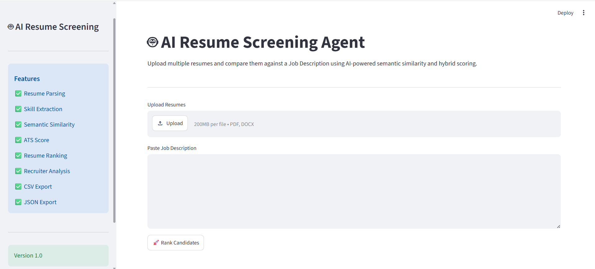
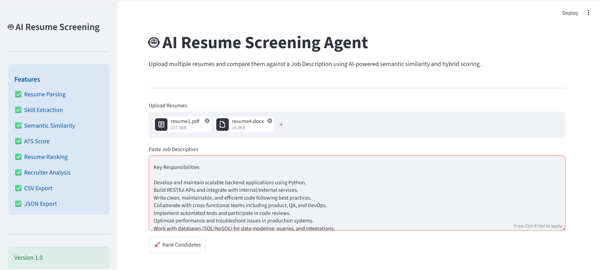
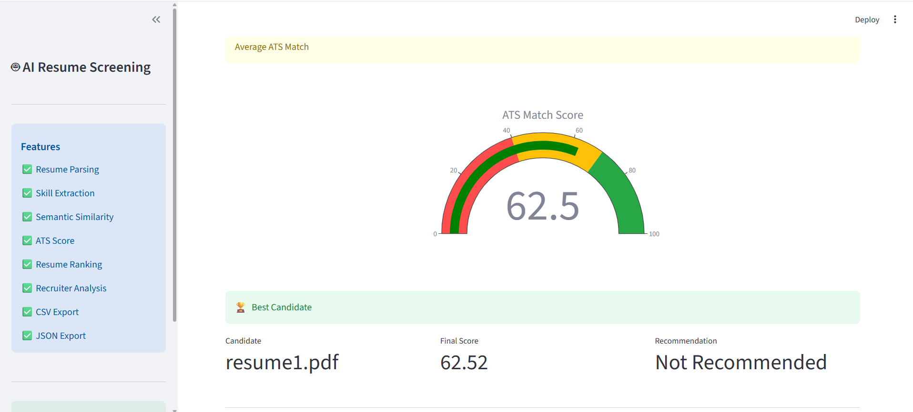
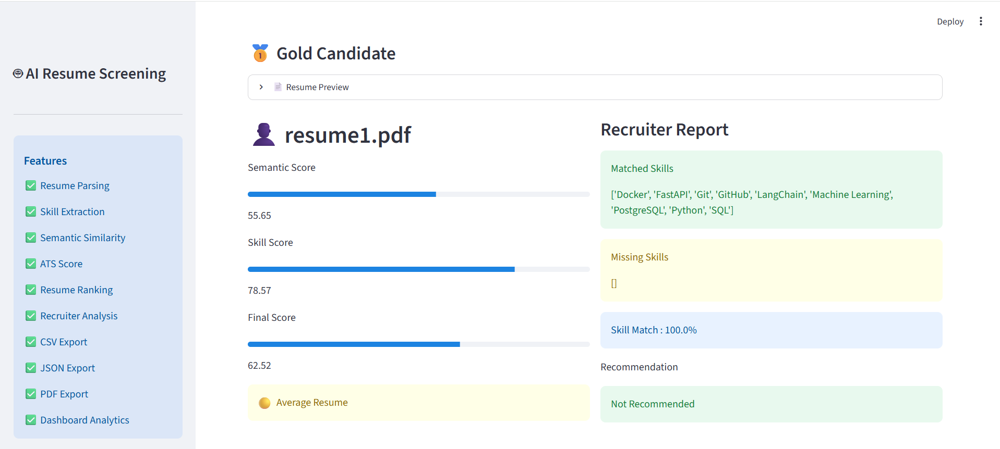
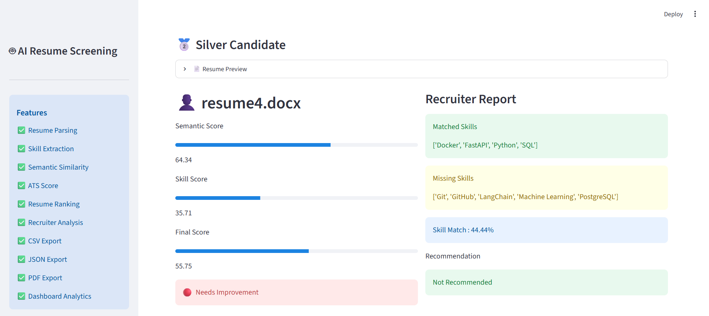
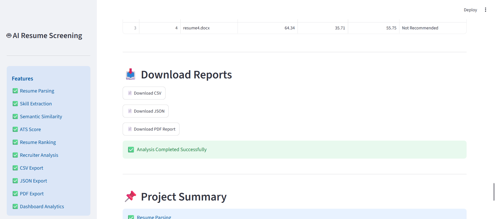
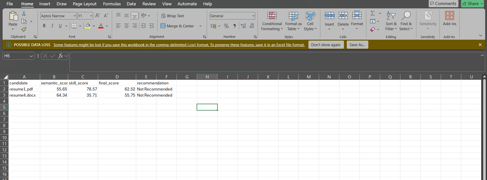
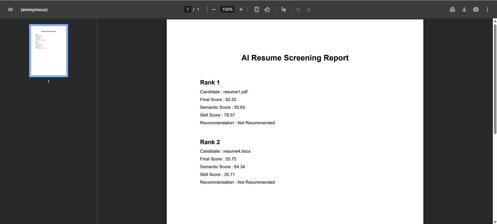

# 🤖 AI Resume Screening Agent

An intelligent Resume Screening and Candidate Ranking System developed using **Natural Language Processing (NLP)** and **Machine Learning**.

The system automatically parses resumes, extracts candidate information, compares resumes against a Job Description using semantic similarity and hybrid scoring, and ranks candidates based on their suitability.

---

# 📌 Problem Statement

Recruiters often spend hours manually reviewing hundreds of resumes.

This project automates the screening process by:

- Parsing PDF and DOCX resumes
- Extracting candidate information
- Comparing resumes with the Job Description
- Ranking candidates using NLP and Machine Learning
- Providing recruiter-friendly recommendations

---

# 🎯 Objectives

- Automate resume screening
- Reduce recruiter effort
- Improve hiring accuracy
- Rank candidates intelligently
- Generate recruiter-friendly reports

---

# ✨ Features

- Resume Parsing
- NLP Semantic Matching
- Hybrid Resume Ranking
- FastAPI REST API
- Streamlit Dashboard
- Recruiter Report
- CSV Export
- JSON Export
- Plotly Visualization

---

# 🛠 Technologies Used

## Programming Language

- Python 3.11

## NLP

- Sentence Transformers
- Transformers

## Machine Learning

- Scikit-learn

## Backend

- FastAPI
- Uvicorn

## Dashboard

- Streamlit
- Plotly

## Libraries

- Pandas
- NumPy
- PyMuPDF
- python-docx
- Pydantic

---

# 📂 Project Structure

```
resume-screening-agent
api/
dashboard/
resume_parser/
similarity/
analysis/
exports/
visualization/
utils/
config/
data/
```

---

# ⚙ Installation

Clone the repository

```bash
git clone https://github.com/yourusername/resume-screening-agent.git
```

Move inside the project

```bash
cd resume-screening-agent
```

Create virtual environment

```bash
python -m venv .venv
```

Activate environment

Windows

```bash
.venv\Scripts\activate
```

Install dependencies

```bash
pip install -r requirements.txt
```

---

# ▶ Running the Project

## Console Version

```bash
python app.py
```

---

## Streamlit Dashboard

```bash
streamlit run dashboard/dashboard.py
```

---

## FastAPI

```bash
uvicorn api.main:app --reload
```

Open

```
http://127.0.0.1:8000/docs
```

---

# 📊 Workflow

1. Upload resumes
2. Parse PDF/DOCX files
3. Extract candidate information
4. Read Job Description
5. Compute semantic similarity
6. Calculate hybrid score
7. Rank candidates
8. Generate recruiter recommendations
9. Export results

---

# 📈 Scoring Parameters

| Parameter | Weight |
|-----------|---------|
| Semantic Similarity | 40% |
| Skill Match | 25% |
| Education | 10% |
| Experience | 10% |
| Certification | 5% |
| Completeness | 10% |

---
## Scoring Method

The final candidate score is calculated using a hybrid approach.

Final Score =
60% Semantic Similarity +
40% Skill Match

Semantic Similarity:
Uses Sentence Transformers embeddings and cosine similarity between the Job Description and Resume.

Skill Match:
Extracted resume skills are compared against JD skills.

Recommendation:
Score ≥ 70 → Recommended
Score < 70 → Not Recommended

## Tradeoffs

Current Version

- Uses keyword-based skill extraction.
- Experience is not weighted separately.
- Education contributes indirectly through semantic similarity.

Future Improvements

- LLM-based reasoning
- Better skill ontology
- ATS keyword optimization
- OCR support for scanned resumes
- Recruiter feedback learning

# 🌐 REST API

## GET /

Returns API status.

---

## GET /health

Checks API health.

---

## POST /upload

Uploads resume files.

---

## POST /rank

Ranks all uploaded resumes.

---

# 📊 Output

The project generates

- Ranked Candidate List
- Semantic Score
- Skill Score
- Education Score
- Experience Score
- Certification Score
- Completeness Score
- Final Score
- Recommendation

---

# 📸 Screenshots

Add screenshots here:

- Streamlit Dashboard

-Resume Uploads

- ATS Score

- Candidate Ranking


- Download Reports

-CSV Report

-PDF Report

---

# 🚀 Future Enhancements

- Authentication
- Database Integration
- Email Shortlisting
- AI Interview Question Generator
- Resume Summarization using LLMs
- Cloud Deployment
- Multi-language Resume Support

---

# 👩‍💻 Developer

**Lahari R**

Bachelor of Engineering (Computer Science Engineering - Data Science)

ATME College of Engineering, Mysore

---

# 📄 License

This project is developed for academic and learning purposes.